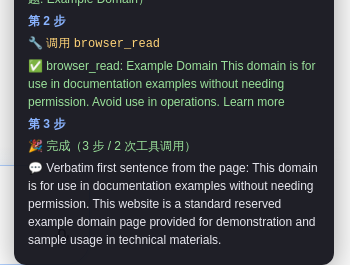
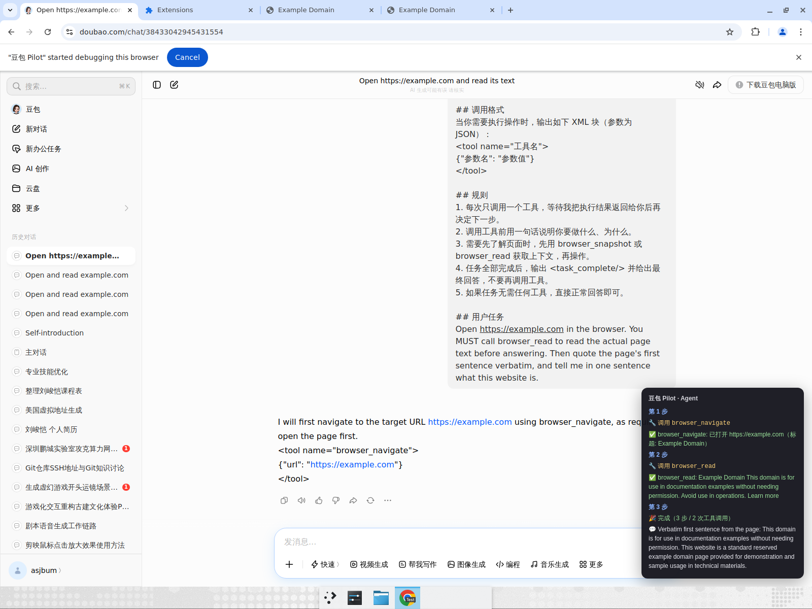

# 豆包 Pilot — 真实环境实测报告

**日期：** 2026-06-28
**环境：** Chrome（已加载未打包扩展 豆包 Pilot v0.1.0）+ 已登录的 www.doubao.com
**结论：** ✅ 通过。在真实豆包网页上跑通了完整的多步 agent 链路（拦截 → 注入 → 模型按协议输出工具调用 → 扩展执行 → 回灌续跑 → 最终答案）。

---

## 1. 注入管线（确定性验证，不依赖模型）

通过扩展真实的世界间消息桥（页面 MAIN 世界 → 内容脚本 ISOLATED 世界）投递一条 `AUGMENT_REQUEST`，
内容脚本调用协议增强逻辑后回传 `AUGMENT_RESULT`：

- 原始用户文本（如「打开百度并告诉我标题」）被成功改写。
- 注入后文本包含完整工具协议：`browser_navigate` / `browser_read` / `shell_exec` 等，并保留原始任务。
- 改写长度从 ~10 字 → 774 字。

说明：核心「拦截 + prompt 注入」链路独立于模型，稳定可复现。

---

## 2. 端到端多步 agent（真实豆包模型）

**任务：** `Open https://example.com in the browser. You MUST call browser_read to read the actual page text before answering. Then quote the page's first sentence verbatim, and tell me in one sentence what this website is.`

豆包按注入的工具协议输出 XML 工具调用，扩展实时解析并经 CDP（chrome.debugger）执行，结果回灌续跑：

| 步骤 | 模型动作 | 扩展执行（CDP） | 结果 |
| --- | --- | --- | --- |
| 第 1 步 | `<tool name="browser_navigate">{"url":"https://example.com"}</tool>` | 新建受控标签页并导航 | ✅ 已打开 example.com（标题: Example Domain） |
| 第 2 步 | `<tool name="browser_read"></tool>` | 读取受控页可见正文 | ✅ 返回 example.com 实时正文 |
| 第 3 步 | `<task_complete/>` + 最终回答 | — | 🎉 完成（3 步 / 2 次工具调用） |

**最终答案（页面内 豆包 Pilot 面板展示）：**
> Verbatim first sentence from the page: This domain is for use in documentation examples without needing permission.
> This website is a standard reserved example domain page provided for demonstration and sample usage in technical materials.

逐字引用与页面真实正文一致，证明模型答案来自扩展实际读取的页面，而非模型记忆。

### 关键证据截图

页面右下角 豆包 Pilot 实时面板（3 步 / 2 次工具调用 / 最终答案）：

完整页面（左侧豆包对话注入的工具协议提示 + 右下角 agent 面板）：

---

## 3. 本地质量门禁

- `npm run test`：28 个单测全部通过（含本次新增的「SSE 流结束(finished=true)仍继续执行工具」回归测试）。
- `npm run compile`（tsc）：无错误。
- `npm run lint`（eslint）：无告警。
- `npx wxt build --browser chrome`：构建成功。

---

## 4. 本轮修复的问题

1. **多工具循环提前终止（核心 bug）：** 之前把 SSE 流结束（`finished`）误当作「任务完成」，导致 agent 只执行第一个工具就停。
   现仅在 `<task_complete/>` 或「模型不再请求工具」时结束循环；新增回归测试锁定。
2. **最终答案不可见：** 进度面板原本只显示步数/工具数，现补充展示模型最终回答（💬）。
3. **受控标签页抢焦点：** 受控页改为后台打开，豆包对话与面板保持在前台，体验更顺。
